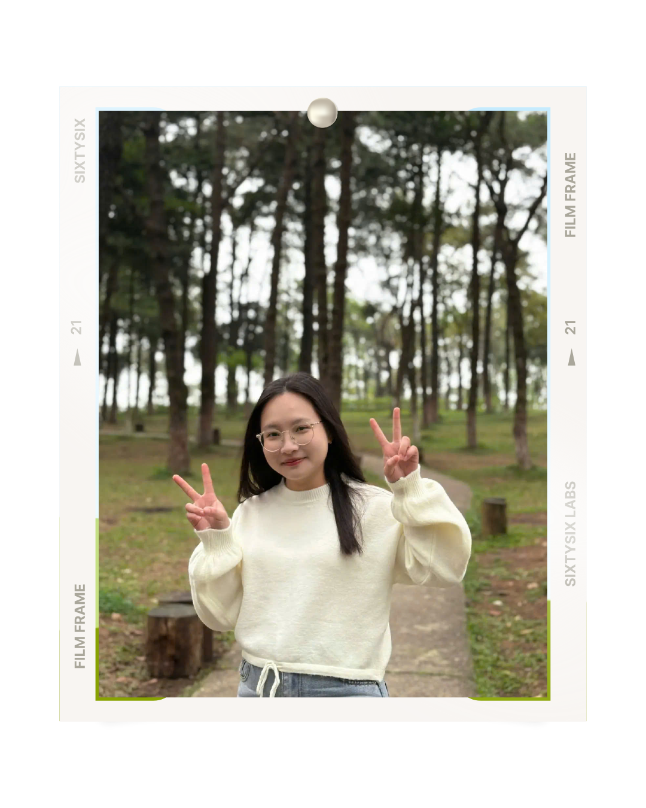

<!-- ═══════════════════════════════════════════════════════════ -->
<!--           GALAXY BANNER — FULL-WIDTH ANIMATED SVG          -->
<!-- ═══════════════════════════════════════════════════════════ -->

<svg width="100%" viewBox="0 0 900 260" xmlns="http://www.w3.org/2000/svg" style="display:block;max-width:100%">
  <defs>
    <!-- Deep space background gradient -->
    <linearGradient id="sky" x1="0%" y1="0%" x2="100%" y2="100%">
      <stop offset="0%"   stop-color="#000010"/>
      <stop offset="30%"  stop-color="#0a0020"/>
      <stop offset="60%"  stop-color="#050030"/>
      <stop offset="100%" stop-color="#000018"/>
    </linearGradient>
    <!-- Galaxy core glow -->
    <radialGradient id="core" cx="50%" cy="52%">
      <stop offset="0%"   stop-color="#ffe4b5" stop-opacity="0.95"/>
      <stop offset="8%"   stop-color="#ffb347" stop-opacity="0.8"/>
      <stop offset="22%"  stop-color="#e040fb" stop-opacity="0.55"/>
      <stop offset="45%"  stop-color="#7c3aed" stop-opacity="0.3"/>
      <stop offset="70%"  stop-color="#1a0050" stop-opacity="0.12"/>
      <stop offset="100%" stop-color="#000010" stop-opacity="0"/>
    </radialGradient>
    <!-- Arm glow left -->
    <radialGradient id="armL" cx="28%" cy="58%">
      <stop offset="0%"  stop-color="#60a5fa" stop-opacity="0.5"/>
      <stop offset="50%" stop-color="#3b82f6" stop-opacity="0.2"/>
      <stop offset="100%" stop-color="#000010" stop-opacity="0"/>
    </radialGradient>
    <!-- Arm glow right -->
    <radialGradient id="armR" cx="72%" cy="44%">
      <stop offset="0%"  stop-color="#f472b6" stop-opacity="0.45"/>
      <stop offset="50%" stop-color="#ec4899" stop-opacity="0.18"/>
      <stop offset="100%" stop-color="#000010" stop-opacity="0"/>
    </radialGradient>
    <!-- Nebula pink -->
    <radialGradient id="neb1" cx="50%" cy="50%">
      <stop offset="0%"  stop-color="#f0abfc" stop-opacity="0.35"/>
      <stop offset="100%" stop-color="#a855f7" stop-opacity="0"/>
    </radialGradient>
    <!-- Nebula blue -->
    <radialGradient id="neb2" cx="50%" cy="50%">
      <stop offset="0%"  stop-color="#93c5fd" stop-opacity="0.3"/>
      <stop offset="100%" stop-color="#2563eb" stop-opacity="0"/>
    </radialGradient>
    <!-- Text gradient -->
    <linearGradient id="txtg" x1="0%" y1="0%" x2="100%" y2="0%">
      <stop offset="0%"   stop-color="#f0abfc"/>
      <stop offset="35%"  stop-color="#e879f9"/>
      <stop offset="65%"  stop-color="#c084fc"/>
      <stop offset="100%" stop-color="#93c5fd"/>
    </linearGradient>
    <filter id="blur2"><feGaussianBlur stdDeviation="2"/></filter>
    <filter id="blur5"><feGaussianBlur stdDeviation="5"/></filter>
    <filter id="blur12"><feGaussianBlur stdDeviation="12"/></filter>
    <filter id="blur20"><feGaussianBlur stdDeviation="20"/></filter>
    <filter id="glow">
      <feGaussianBlur stdDeviation="3" result="blur"/>
      <feMerge><feMergeNode in="blur"/><feMergeNode in="SourceGraphic"/></feMerge>
    </filter>
  </defs>

  <!-- Background -->
  <rect width="900" height="260" fill="url(#sky)"/>

  <!-- Nebulae blobs -->
  <ellipse cx="200" cy="150" rx="160" ry="80" fill="url(#neb1)" filter="url(#blur20)"/>
  <ellipse cx="700" cy="110" rx="140" ry="70" fill="url(#neb2)" filter="url(#blur20)"/>
  <ellipse cx="450" cy="200" rx="200" ry="60" fill="url(#armL)" filter="url(#blur12)"/>

  <!-- Galaxy spiral arms (blurred ellipses at angles) -->
  <ellipse cx="450" cy="135" rx="380" ry="38" fill="none" stroke="#c084fc" stroke-width="22" opacity="0.07" transform="rotate(-18 450 135)" filter="url(#blur12)"/>
  <ellipse cx="450" cy="135" rx="300" ry="28" fill="none" stroke="#818cf8" stroke-width="16" opacity="0.09" transform="rotate(12 450 135)" filter="url(#blur12)"/>
  <ellipse cx="450" cy="135" rx="220" ry="20" fill="none" stroke="#a78bfa" stroke-width="12" opacity="0.12" transform="rotate(-8 450 135)" filter="url(#blur5)"/>
  <ellipse cx="450" cy="135" rx="150" ry="14" fill="none" stroke="#e879f9" stroke-width="8" opacity="0.18" transform="rotate(22 450 135)" filter="url(#blur5)"/>

  <!-- Arm glow overlays -->
  <ellipse cx="255" cy="150" rx="180" ry="55" fill="url(#armL)" filter="url(#blur12)"/>
  <ellipse cx="645" cy="118" rx="170" ry="52" fill="url(#armR)" filter="url(#blur12)"/>

  <!-- Galaxy core -->
  <ellipse cx="450" cy="135" rx="90" ry="90" fill="url(#core)" filter="url(#blur12)"/>
  <ellipse cx="450" cy="135" rx="28" ry="28" fill="#ffe4b5" opacity="0.9" filter="url(#blur5)"/>
  <ellipse cx="450" cy="135" rx="10" ry="10" fill="white" opacity="0.95" filter="url(#blur2)"/>

  <!-- ── STATIC STARS (many, scattered) ── -->
  <!-- bright -->
  <circle cx="42"  cy="18"  r="1.6" fill="white" opacity="0.95"/>
  <circle cx="830" cy="22"  r="1.8" fill="white" opacity="0.9"/>
  <circle cx="120" cy="240" r="1.5" fill="#e9d5ff" opacity="0.85"/>
  <circle cx="780" cy="245" r="1.6" fill="white" opacity="0.9"/>
  <circle cx="880" cy="130" r="1.4" fill="#bae6fd" opacity="0.88"/>
  <circle cx="15"  cy="160" r="1.5" fill="white" opacity="0.85"/>
  <!-- medium -->
  <circle cx="75"  cy="55"  r="1.1" fill="#e9d5ff" opacity="0.8"/>
  <circle cx="180" cy="25"  r="1"   fill="white" opacity="0.75"/>
  <circle cx="320" cy="14"  r="1.2" fill="#bfdbfe" opacity="0.82"/>
  <circle cx="560" cy="10"  r="1.1" fill="white" opacity="0.78"/>
  <circle cx="710" cy="20"  r="1.3" fill="#e9d5ff" opacity="0.8"/>
  <circle cx="860" cy="55"  r="1"   fill="white" opacity="0.72"/>
  <circle cx="895" cy="200" r="1.2" fill="#bae6fd" opacity="0.75"/>
  <circle cx="30"  cy="230" r="1.1" fill="white" opacity="0.7"/>
  <circle cx="650" cy="248" r="1.3" fill="#e9d5ff" opacity="0.78"/>
  <circle cx="820" cy="190" r="1"   fill="white" opacity="0.72"/>
  <!-- small scatter -->
  <circle cx="55"  cy="100" r="0.8" fill="white" opacity="0.6"/>
  <circle cx="100" cy="195" r="0.7" fill="#c4b5fd" opacity="0.65"/>
  <circle cx="150" cy="70"  r="0.8" fill="white" opacity="0.6"/>
  <circle cx="230" cy="210" r="0.7" fill="white" opacity="0.55"/>
  <circle cx="290" cy="235" r="0.8" fill="#bfdbfe" opacity="0.6"/>
  <circle cx="370" cy="22"  r="0.7" fill="white" opacity="0.58"/>
  <circle cx="480" cy="8"   r="0.9" fill="#e9d5ff" opacity="0.65"/>
  <circle cx="600" cy="240" r="0.7" fill="white" opacity="0.55"/>
  <circle cx="720" cy="250" r="0.8" fill="#c4b5fd" opacity="0.6"/>
  <circle cx="800" cy="60"  r="0.7" fill="white" opacity="0.58"/>
  <circle cx="860" cy="165" r="0.8" fill="#bae6fd" opacity="0.6"/>
  <circle cx="888" cy="95"  r="0.7" fill="white" opacity="0.55"/>
  <circle cx="340" cy="255" r="0.6" fill="white" opacity="0.5"/>
  <circle cx="500" cy="252" r="0.7" fill="#e9d5ff" opacity="0.55"/>
  <circle cx="760" cy="15"  r="0.7" fill="white" opacity="0.6"/>
  <circle cx="20"  cy="80"  r="0.6" fill="white" opacity="0.5"/>
  <circle cx="890" cy="35"  r="0.6" fill="#bfdbfe" opacity="0.52"/>

  <!-- ── TWINKLING STARS (animated) ── -->
  <circle cx="62"  cy="38"  r="1.5" fill="white"><animate attributeName="opacity" values="0.9;0.15;0.9" dur="2.1s" repeatCount="indefinite"/></circle>
  <circle cx="810" cy="42"  r="1.6" fill="#e9d5ff"><animate attributeName="opacity" values="0.85;0.1;0.85" dur="1.8s" repeatCount="indefinite"/></circle>
  <circle cx="160" cy="185" r="1.3" fill="white"><animate attributeName="opacity" values="0.8;0.2;0.8" dur="2.6s" repeatCount="indefinite"/></circle>
  <circle cx="740" cy="195" r="1.4" fill="#bae6fd"><animate attributeName="opacity" values="0.88;0.12;0.88" dur="1.5s" repeatCount="indefinite"/></circle>
  <circle cx="600" cy="28"  r="1.2" fill="#e9d5ff"><animate attributeName="opacity" values="0.75;0.1;0.75" dur="3s" repeatCount="indefinite"/></circle>
  <circle cx="350" cy="245" r="1.3" fill="white"><animate attributeName="opacity" values="0.82;0.15;0.82" dur="2.3s" repeatCount="indefinite"/></circle>
  <circle cx="875" cy="150" r="1.1" fill="#c4b5fd"><animate attributeName="opacity" values="0.7;0.08;0.7" dur="2.8s" repeatCount="indefinite"/></circle>
  <circle cx="25"  cy="45"  r="1.2" fill="white"><animate attributeName="opacity" values="0.85;0.18;0.85" dur="1.9s" repeatCount="indefinite"/></circle>
  <circle cx="270" cy="15"  r="1.1" fill="#bfdbfe"><animate attributeName="opacity" values="0.78;0.12;0.78" dur="2.4s" repeatCount="indefinite"/></circle>
  <circle cx="680" cy="255" r="1.2" fill="white"><animate attributeName="opacity" values="0.8;0.15;0.8" dur="2.7s" repeatCount="indefinite"/></circle>
  <!-- shooting star -->
  <line x1="-30" y1="40" x2="0" y2="38" stroke="white" stroke-width="1.2" opacity="0">
    <animate attributeName="x1" values="-30;960" dur="4s" begin="1s" repeatCount="indefinite"/>
    <animate attributeName="x2" values="0;1000" dur="4s" begin="1s" repeatCount="indefinite"/>
    <animate attributeName="y1" values="40;80" dur="4s" begin="1s" repeatCount="indefinite"/>
    <animate attributeName="y2" values="38;78" dur="4s" begin="1s" repeatCount="indefinite"/>
    <animate attributeName="opacity" values="0;0.9;0.9;0" dur="4s" begin="1s" repeatCount="indefinite"/>
  </line>
  <!-- shooting star 2 -->
  <line x1="-30" y1="200" x2="0" y2="198" stroke="#c4b5fd" stroke-width="1" opacity="0">
    <animate attributeName="x1" values="-30;900" dur="3.5s" begin="6s" repeatCount="indefinite"/>
    <animate attributeName="x2" values="0;930"  dur="3.5s" begin="6s" repeatCount="indefinite"/>
    <animate attributeName="y1" values="200;230" dur="3.5s" begin="6s" repeatCount="indefinite"/>
    <animate attributeName="y2" values="198;228" dur="3.5s" begin="6s" repeatCount="indefinite"/>
    <animate attributeName="opacity" values="0;0.85;0.85;0" dur="3.5s" begin="6s" repeatCount="indefinite"/>
  </line>

  <!-- ── ORBITING PLANETS around core ── -->
  <!-- Planet 1: orbit ellipse guide -->
  <ellipse id="op1" cx="450" cy="135" rx="110" ry="32" fill="none" transform="rotate(-15 450 135)"/>
  <circle r="5" fill="#f472b6" filter="url(#glow)">
    <animateMotion dur="7s" repeatCount="indefinite">
      <mpath href="#op1"/>
    </animateMotion>
  </circle>
  <!-- Planet 2 -->
  <ellipse id="op2" cx="450" cy="135" rx="145" ry="42" fill="none" transform="rotate(20 450 135)"/>
  <circle r="3.5" fill="#60a5fa" filter="url(#glow)">
    <animateMotion dur="11s" repeatCount="indefinite">
      <mpath href="#op2"/>
    </animateMotion>
  </circle>
  <!-- Planet 3 (tiny) -->
  <ellipse id="op3" cx="450" cy="135" rx="80" ry="22" fill="none" transform="rotate(5 450 135)"/>
  <circle r="2.5" fill="#fde68a">
    <animateMotion dur="4.5s" repeatCount="indefinite">
      <mpath href="#op3"/>
    </animateMotion>
  </circle>

  <!-- ── NAME TEXT ── -->
  <text x="450" y="108"
    font-family="Georgia, serif"
    font-size="38"
    font-weight="bold"
    fill="url(#txtg)"
    text-anchor="middle"
    filter="url(#glow)"
    letter-spacing="3">Trần Khánh Ngọc</text>

  <!-- Sub text -->
  <text x="450" y="175"
    font-family="monospace"
    font-size="13"
    fill="#c4b5fd"
    text-anchor="middle"
    opacity="0.9"
    letter-spacing="1.5">🌌 FTU · International Business · Future Business Analyst 🌌</text>

  <!-- Bottom divider line -->
  <line x1="200" y1="195" x2="700" y2="195" stroke="url(#txtg)" stroke-width="0.8" opacity="0.4"/>

  <!-- Rotating ring around core (decorative) -->
  <ellipse cx="450" cy="135" rx="55" ry="16" fill="none" stroke="#e9d5ff" stroke-width="0.7" opacity="0.4">
    <animateTransform attributeName="transform" type="rotate" from="0 450 135" to="360 450 135" dur="8s" repeatCount="indefinite"/>
  </ellipse>
</svg>

<!-- TYPING SVG -->

 

<!-- ════════════════════════════════════════════════════ -->
<!--               MAIN TWO-COLUMN LAYOUT               -->
<!-- ════════════════════════════════════════════════════ -->
<table width="100%" border="0" cellpadding="0" cellspacing="0">
<tr>

<!-- ══ LEFT PANEL ══ -->
<td width="30%" valign="top" align="center">

 

  

<!-- MINI GALAXY ORB SVG -->
<svg width="150" height="150" viewBox="0 0 160 160" xmlns="http://www.w3.org/2000/svg">
  <defs>
    <radialGradient id="p2" cx="35%" cy="30%">
      <stop offset="0%"  stop-color="#fde68a"/>
      <stop offset="30%" stop-color="#f472b6"/>
      <stop offset="65%" stop-color="#7c3aed"/>
      <stop offset="100%" stop-color="#0a0020"/>
    </radialGradient>
    <radialGradient id="h2" cx="50%" cy="50%">
      <stop offset="0%" stop-color="#a855f7" stop-opacity="0.4"/>
      <stop offset="100%" stop-color="#a855f7" stop-opacity="0"/>
    </radialGradient>
    <filter id="sg"><feGaussianBlur stdDeviation="2.5" result="b"/><feMerge><feMergeNode in="b"/><feMergeNode in="SourceGraphic"/></feMerge></filter>
  </defs>
  <circle cx="80" cy="80" r="74" fill="url(#h2)"/>
  <circle cx="80" cy="80" r="48" fill="url(#p2)"/>
  <ellipse cx="65" cy="58" rx="15" ry="8" fill="white" opacity="0.14" transform="rotate(-28 65 58)"/>
  <!-- rings -->
  <ellipse cx="80" cy="80" rx="70" ry="20" fill="none" stroke="#e879f9" stroke-width="1.3" opacity="0.6">
    <animateTransform attributeName="transform" type="rotate" from="0 80 80" to="360 80 80" dur="5s" repeatCount="indefinite"/>
  </ellipse>
  <circle r="4.5" fill="#f0abfc" filter="url(#sg)">
    <animateMotion dur="5s" repeatCount="indefinite" path="M 10 80 A 70 20 0 1 1 10.001 80"/>
  </circle>
  <ellipse cx="80" cy="80" rx="58" ry="15" fill="none" stroke="#60a5fa" stroke-width="0.8" opacity="0.35">
    <animateTransform attributeName="transform" type="rotate" from="40 80 80" to="400 80 80" dur="9s" repeatCount="indefinite"/>
  </ellipse>
  <!-- twinkle stars -->
  <circle cx="20" cy="24" r="1.4" fill="#fde68a"><animate attributeName="opacity" values="1;0.2;1" dur="2.2s" repeatCount="indefinite"/></circle>
  <circle cx="138" cy="32" r="1.1" fill="#c4b5fd"><animate attributeName="opacity" values="0.8;0.1;0.8" dur="1.7s" repeatCount="indefinite"/></circle>
  <circle cx="128" cy="138" r="1.5" fill="#fde68a"><animate attributeName="opacity" values="0.9;0.15;0.9" dur="2.8s" repeatCount="indefinite"/></circle>
  <circle cx="24" cy="128" r="1" fill="#93c5fd"><animate attributeName="opacity" values="0.85;0.2;0.85" dur="2s" repeatCount="indefinite"/></circle>
  <circle cx="150" cy="95" r="1.2" fill="#f0abfc"><animate attributeName="opacity" values="0.7;0.1;0.7" dur="3.2s" repeatCount="indefinite"/></circle>
  <circle cx="65" cy="150" r="1" fill="white"><animate attributeName="opacity" values="0.75;0.1;0.75" dur="1.5s" repeatCount="indefinite"/></circle>
</svg>

 

**📬 Contact Me**

📧 ngoc27122006@gmail.com

---

*"It doesn't matter how slowly*
*you go, as long as you don't stop."*

---

</td>

<td width="2%"></td>

<!-- ══ RIGHT PANEL ══ -->
<td width="68%" valign="top">

 

## 💫 About Me

Xin chào, mình là **Khánh Ngọc** ✨ — sinh viên năm 2 ngành **Kinh doanh Quốc tế** tại **Trường Đại học Ngoại thương**, đang đảm nhiệm vai trò **Phó ban Đối ngoại** tại ***Social Business Creation Youth Community (SBCYC – FTU)***.

Là sinh viên kinh tế yêu thích lập trình, mình đặc biệt quan tâm đến sự giao thoa giữa **tư duy kinh doanh và công nghệ**. Mình đang phát triển theo lộ trình **Business Analyst** — chuyển hóa dữ liệu thành giải pháp tạo ra giá trị thực cho doanh nghiệp.

---

## 💻 Technical Skills

---

## 🌟 Soft Skills

| 🗣️ Communication | 🎤 Presentation | 🤝 Teamwork | 🧠 Problem Solving |
|:-:|:-:|:-:|:-:|
| ⏳ Time Management | 📌 Coordination | 🔎 Critical Thinking | 🌱 Adaptability |

---

## 🚀 Projects

<b>📊 Business Performance Dashboard — Power BI</b>

 

> **Role:** Data Analyst &nbsp;|&nbsp; **Tools:** `Power BI` `Excel` `DAX` `Data Modeling`

Developed an **interactive BI dashboard** to analyze company performance and support strategic decision-making.

- 🧹 Cleaned & transformed raw business datasets
- 🏗️ Built relational data model connecting multiple sources
- 📐 Created DAX measures: Revenue, Profit, Growth Rate, Regional Performance
- 📊 Designed interactive drill-through dashboards with slicers & filters
- 🎯 Presented data-driven insights with strategic recommendations

**🎯 Impact:** Turned raw operational data into actionable intelligence.

---

<b>📈 Exploratory Data Analysis — Python</b>

 

> **Role:** Data Analyst &nbsp;|&nbsp; **Tools:** `Python` `Pandas` `NumPy` `Matplotlib` `Seaborn`

- 🧹 Data cleaning, preprocessing & outlier detection
- 📉 Statistical analysis & hypothesis testing
- 📊 Multi-dimensional trend & pattern visualization
- 💡 Insight generation for business strategy

---

<b>🛒 Market Entry Analysis — International Business</b>

 

> **Role:** Research & Strategy &nbsp;|&nbsp; **Tools:** `Excel` `PowerPoint` `PESTLE` `Porter's Five Forces`

- 🌍 PESTLE & SWOT analysis for 3 target markets
- ⚔️ Competitive landscape mapping via Porter's Five Forces
- 💰 Financial feasibility & risk assessment
- 📑 Full strategy report with go/no-go recommendation

---

<b>🗃️ Student Management Database System — MySQL + Java</b>

 

> **Role:** Developer &nbsp;|&nbsp; **Tools:** `MySQL` `Java` `JDBC` `ER Diagram`

- 🏗️ ER diagram design & schema normalization (3NF)
- 🗄️ Stored procedures, triggers, constraints
- ☕ Java JDBC CRUD interface
- 🔒 Role-based access control (Admin / Student)

---

<b>🌐 Personal Portfolio Website</b>

 

> **Role:** Developer & Designer &nbsp;|&nbsp; **Tools:** `HTML5` `CSS3` `JavaScript` `GitHub Pages`

- 🎨 4-theme color switcher · Canvas particle system · Custom cursor
- 📱 Fully responsive · Sticky split layout
- **Live:** [khanhngoc2712.github.io](https://khanhngoc2712.github.io)

---

<b>📋 BA Learning Roadmap Tracker</b>

 

> **Role:** Self-learner &nbsp;|&nbsp; **Tools:** `Markdown` `GitHub` `Notion`

Structured **Business Analyst self-learning journey** covering: SQL · Power BI · Python for Data · BABOK fundamentals

---

## 📊 GitHub Stats

&nbsp;

---

### ✍️ Random Dev Quote

</td>
</tr>
</table>

---

## 📸 Activities & Events

<table>
<tr>
<td align="center" width="33%"> <b>🌟 Sự kiện 1</b></td>
<td align="center" width="33%"> <b>🎉 Sự kiện 2</b></td>
<td align="center" width="33%"> <b>💡 Sự kiện 3</b></td>
</tr>
<tr>
<td align="center" width="33%"> <b>🏆 Sự kiện 4</b></td>
<td align="center" width="33%"> <b>🔥 Sự kiện 5</b></td>
<td align="center" width="33%"> <b>✨ Sự kiện 6</b></td>
</tr>
</table>

---

<!-- GALAXY FOOTER SVG -->

<svg width="100%" viewBox="0 0 900 90" xmlns="http://www.w3.org/2000/svg" style="display:block;max-width:100%">
  <defs>
    <linearGradient id="fsky" x1="0%" y1="0%" x2="100%" y2="0%">
      <stop offset="0%"   stop-color="#000010"/>
      <stop offset="30%"  stop-color="#0d0030"/>
      <stop offset="50%"  stop-color="#1e0050"/>
      <stop offset="70%"  stop-color="#0d0030"/>
      <stop offset="100%" stop-color="#000010"/>
    </linearGradient>
    <radialGradient id="fcore" cx="50%" cy="60%">
      <stop offset="0%"  stop-color="#e879f9" stop-opacity="0.6"/>
      <stop offset="40%" stop-color="#7c3aed" stop-opacity="0.25"/>
      <stop offset="100%" stop-color="#000010" stop-opacity="0"/>
    </radialGradient>
    <filter id="fb"><feGaussianBlur stdDeviation="5"/></filter>
  </defs>
  <rect width="900" height="90" fill="url(#fsky)"/>
  <ellipse cx="450" cy="80" rx="350" ry="60" fill="url(#fcore)" filter="url(#fb)"/>
  <!-- stars -->
  <circle cx="50"  cy="20" r="1.2" fill="white" opacity="0.7"><animate attributeName="opacity" values="0.7;0.1;0.7" dur="2.1s" repeatCount="indefinite"/></circle>
  <circle cx="850" cy="15" r="1.3" fill="#e9d5ff" opacity="0.8"><animate attributeName="opacity" values="0.8;0.15;0.8" dur="1.7s" repeatCount="indefinite"/></circle>
  <circle cx="200" cy="35" r="1"   fill="white" opacity="0.6"><animate attributeName="opacity" values="0.6;0.1;0.6" dur="2.5s" repeatCount="indefinite"/></circle>
  <circle cx="700" cy="30" r="1.1" fill="#c4b5fd" opacity="0.65"><animate attributeName="opacity" values="0.65;0.1;0.65" dur="2.8s" repeatCount="indefinite"/></circle>
  <circle cx="400" cy="12" r="1"   fill="white" opacity="0.55"><animate attributeName="opacity" values="0.55;0.08;0.55" dur="3s" repeatCount="indefinite"/></circle>
  <circle cx="600" cy="18" r="1.2" fill="#fde68a" opacity="0.6"><animate attributeName="opacity" values="0.6;0.1;0.6" dur="1.9s" repeatCount="indefinite"/></circle>
  <!-- footer text -->
  <text x="450" y="58" font-family="Georgia,serif" font-size="13" fill="#c4b5fd" text-anchor="middle" opacity="0.85" letter-spacing="2">© 2024 Trần Khánh Ngọc · Made with 🌌 across the galaxy</text>
</svg>

